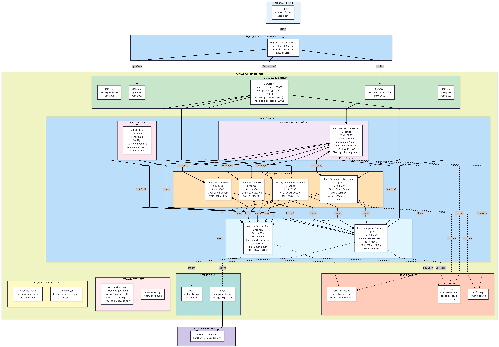

# Crypto-Analysis

Crypto-Analysis to headless system benchmarkowy do porównywania implementacji ECIES w Pythonie i C++. Projekt uruchamia ten sam scenariusz kryptograficzny na kilku bibliotekach, zbiera wyniki, zapisuje je w PostgreSQL i udostępnia przez API oraz Grafanę.

To nie jest klasyczna aplikacja z interfejsem użytkownika. To zestaw usług, manifestów i skryptów DevOps zaprojektowanych tak, żeby można było powtarzalnie uruchamiać benchmarki lokalnie w Docker Compose, lokalnie w Kubernetesie na Minikube albo w klastrze zarządzanym manifestami z repozytorium.

---

## Co ten projekt robi

Projekt odpowiada na cztery podstawowe pytania:

1. która implementacja ECIES działa najszybciej,
2. jak zachowują się różne biblioteki pod obciążeniem,
3. czy wyniki można trwale zapisywać i później analizować,
4. czy cały pipeline uruchomienia, budowania, wdrożenia i skanowania bezpieczeństwa jest powtarzalny.

W praktyce system pozwala uruchamiać benchmarki kryptograficzne, porównywać je między językami i bibliotekami, a następnie oglądać wyniki w postaci JSON, CSV, rekordów w bazie i dashboardów w Grafanie.

---
## Wykorzystane technologie

| Obszar | Technologie |
| --- | --- |
| Backend | FastAPI, Uvicorn, Pydantic |
| Kryptografia Python | `cryptography`, `PyCryptodome` |
| Kryptografia C++ | OpenSSL, Crypto++ |
| Bazy i broker | PostgreSQL, Redis |
| Konteneryzacja | Docker, Docker Compose |
| Kubernetes | Kubernetes, Minikube, Kustomize, Nginx Ingress |
| GitOps | Argo CD manifesty przygotowane w `k8s/` |
| Monitoring | Grafana |
| Testy i benchmarki | k6, własne skrypty benchmarkowe |
| Bezpieczeństwo | Trivy, SBOM, CycloneDX |
| Automatyzacja | Python, PowerShell, Bash |

---

## Architektura

Rdzeń systemu jest prosty i celowo rozdzielony na niezależne elementy:

1. **Benchmark Controller** przyjmuje żądania API, uruchamia testy i zapisuje wyniki.
2. **Cztery węzły kryptograficzne** wykonują benchmarki tej samej logiki ECIES w różnych implementacjach.
3. **Redis** działa jako broker komunikatów i szybka warstwa pośrednia.
4. **PostgreSQL** przechowuje historię uruchomień i wyniki pomiarów.
5. **Grafana** służy do wizualizacji wyników i monitoringu.
6. **Nginx Ingress** wystawia kontrolowany dostęp HTTP do usług w klastrze.

Wersja lokalna i klastrowa tego układu jest opisana manifestami Kubernetes, a w środowisku developerskim można go uruchomić przez Docker Compose.




---

## Komponenty systemu

### Benchmark Controller

Usługa napisana w Pythonie z użyciem FastAPI. Wystawia REST API, sprawdza poprawność danych wejściowych, odpala benchmarki i udostępnia wyniki w formacie JSON oraz CSV.


### Węzły kryptograficzne

Projekt porównuje cztery implementacje tego samego schematu ECIES:

- Python `cryptography`
- Python `PyCryptodome`
- C++ `OpenSSL`
- C++ `Crypto++`

Każdy węzeł udostępnia prosty interfejs HTTP i wykonuje testy szyfrowania, deszyfrowania oraz pomiarów wydajności.

### Redis

Redis pełni rolę szybkiej warstwy pośredniej i brokera komunikatów. W konfiguracji Docker Compose działa także jako usługa z trwałością AOF.

### PostgreSQL

PostgreSQL przechowuje historię uruchomień benchmarków oraz szczegółowe wyniki pomiarów. Dzięki temu można porównywać kolejne testy i budować długoterminową analizę.

### Grafana

Grafana służy do wizualizacji wyników i podglądu metryk. Repozytorium zawiera też manifesty sieciowe i konfigurację pozwalającą wystawić ją w klastrze Kubernetes.

---

## Infrastruktura i bezpieczeństwo

W repozytorium znajdują się manifesty Kubernetes opisujące:

- namespace całego systemu,
- ServiceAccount i RBAC,
- ConfigMap i Secrets,
- PersistentVolumeClaim oraz storage,
- ResourceQuota i LimitRange,
- NetworkPolicy i politykę dla Grafany,
- Ingress,
- deployment PostgreSQL, Redis, kontrolera, węzłów i Grafany.

To oznacza, że system nie składa się tylko z aplikacji, ale z pełnej warstwy infrastrukturalnej potrzebnej do stabilnego uruchamiania i testowania benchmarków.

W repozytorium są też pliki przygotowane pod Argo CD:

- [k8s/argocd-application.yaml](k8s/argocd-application.yaml)
- [k8s/argocd-appproject.yaml](k8s/argocd-appproject.yaml)

---

## Uruchomienie lokalne

### Docker Compose

Do pracy lokalnej można użyć:

```bash
docker compose -f docker-compose.dev.yml up --build
```

### Kubernetes na Minikube

Lokalne wdrożenie Kubernetes można zbudować na Minikube, a manifesty znajdują się w katalogu [k8s](k8s).

Typowy przebieg wygląda tak:

```powershell
minikube start
kubectl apply -k k8s/
kubectl get pods -n crypto-perf
kubectl get services -n crypto-perf
```

---

## Przydatne ścieżki w repozytorium

- [benchmark-controller/main.py](benchmark-controller/main.py) - główny kontroler API.
- [node-py-crypto/lib_cryptography.py](node-py-crypto/lib_cryptography.py) - implementacja ECIES na bibliotece Cryptography.
- [node-py-pycryptodome/lib_pycryptodome.py](node-py-pycryptodome/lib_pycryptodome.py) - implementacja ECIES na PyCryptodome.
- [node-cpp-openssl/main.cpp](node-cpp-openssl/main.cpp) - węzeł C++ oparty o OpenSSL.
- [node-cpp-cryptopp/main.cpp](node-cpp-cryptopp/main.cpp) - węzeł C++ oparty o Crypto++.
- [perf/](perf) - benchmarki, raporty i narzędzia analityczne.


---
## Scenariusze testowe w `perf/`

Katalog [perf/](perf) zawiera scenariusze testowe i skrypty do benchmarków oraz analizy wyników. Znajdują się tam między innymi:

- scenariusze performance i scalability dla k6,
- scenariusze stability do testów długotrwałych,
- skrypty do raportowania i importu wyników do PostgreSQL,
- pliki z wynikami JSON używane do porównywania bibliotek i kolejnych uruchomień.

To właśnie w `perf/` jest praktyczna część eksperymentu: uruchamianie testów, zbieranie metryk i analiza tego, jak zachowują się biblioteki ECIES pod różnym obciążeniem.

---


