# Warunek 2


## Polecenia weryfikacji

---

### 1. Walidacja docker-compose.yml
```powershell
docker-compose config
```
**Wynik: cała konfigurację bez błędów**

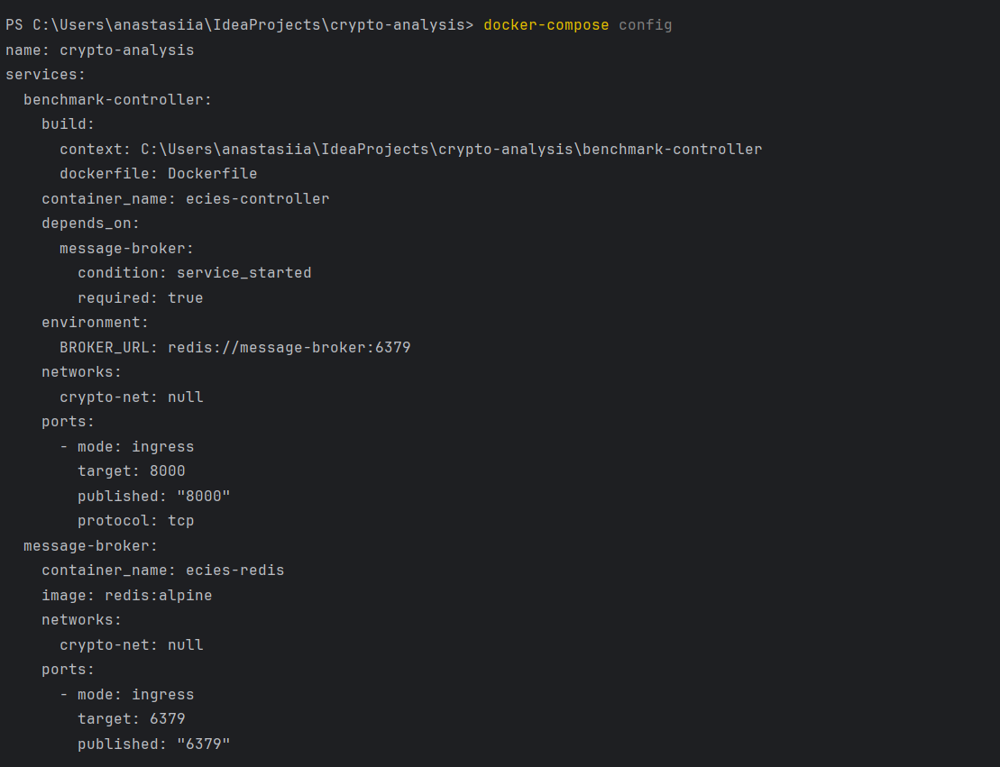
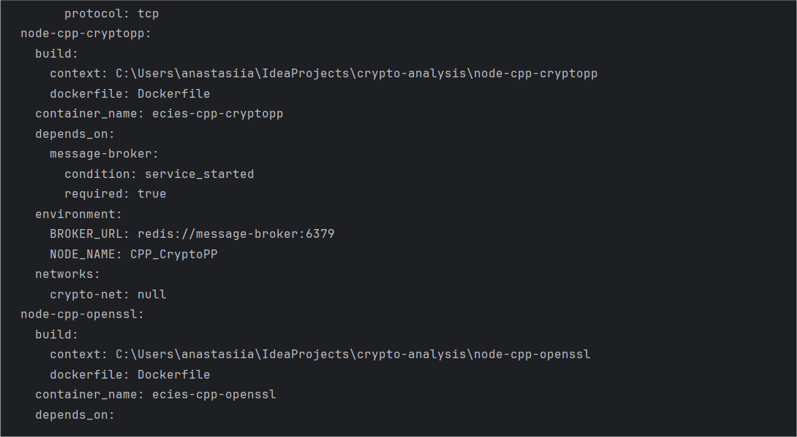
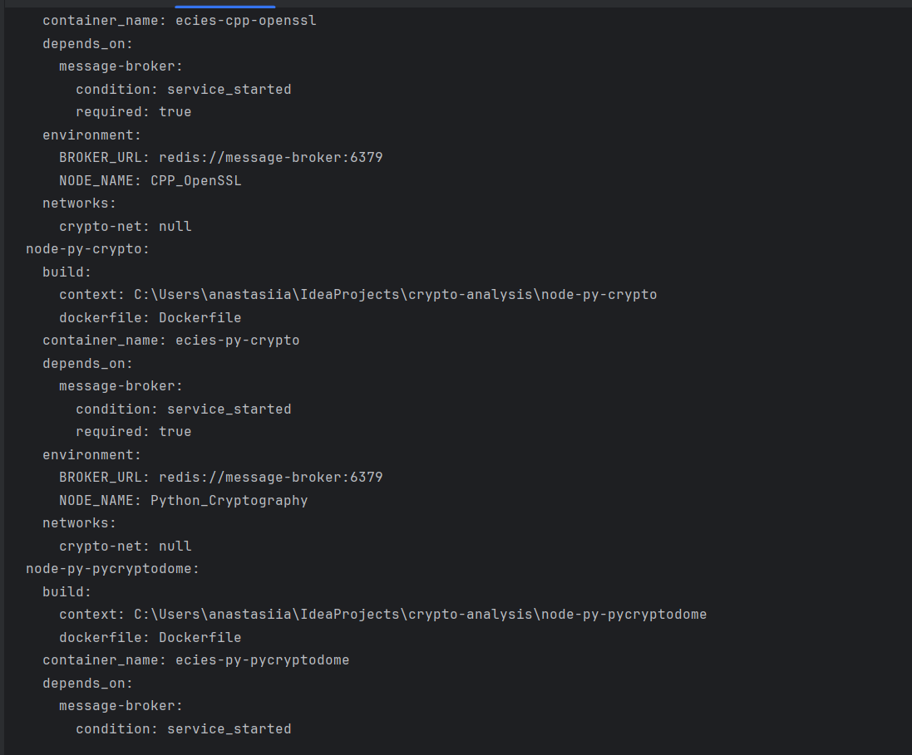
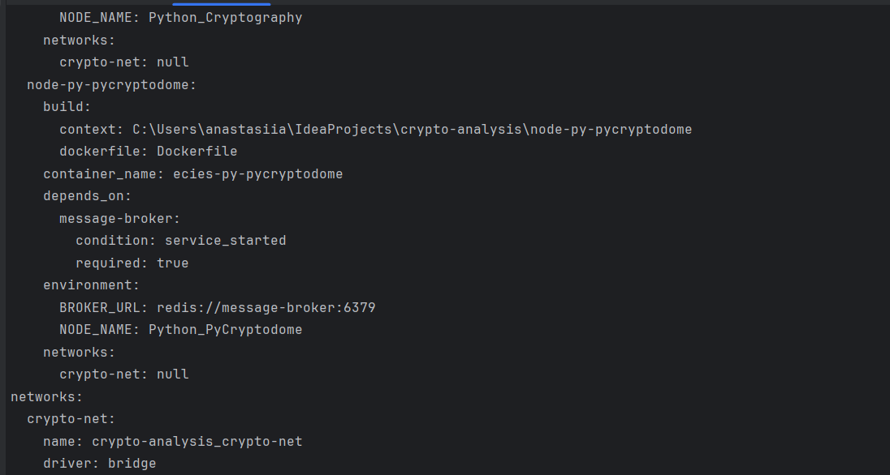
---
### 2. Status serwisów

```powershell
docker-compose ps
```
**Wynik: wszystkie 6 serwisów mają status `Up`**

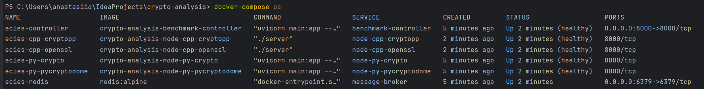

---

### 3. Sprawdzenie sieci Docker

```powershell
docker network ls
```

**Wynik: sieć `crypto-analysis_crypto-net` (ID: 0ffbfddfa127) prawidłowo utworzona**

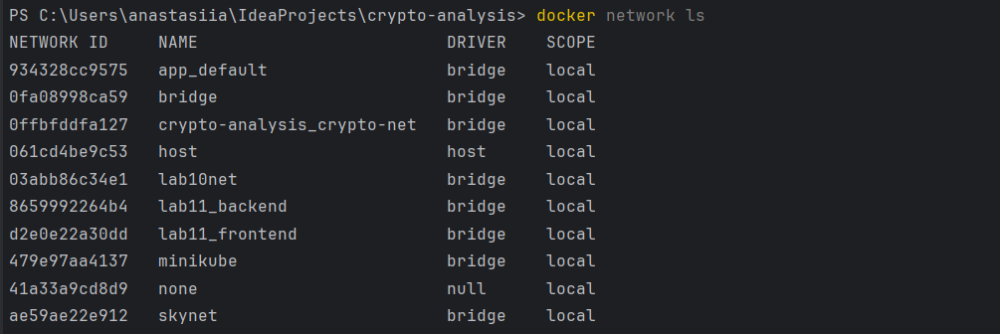

---

### 4. Sprawdzenie szczegółów sieci

```powershell
docker network inspect crypto-analysis_crypto-net
```

**Wynik: wszystkich 6 kontenerów podłączonych do sieci `crypto-analysis_crypto-net` (172.23.0.0/16)**

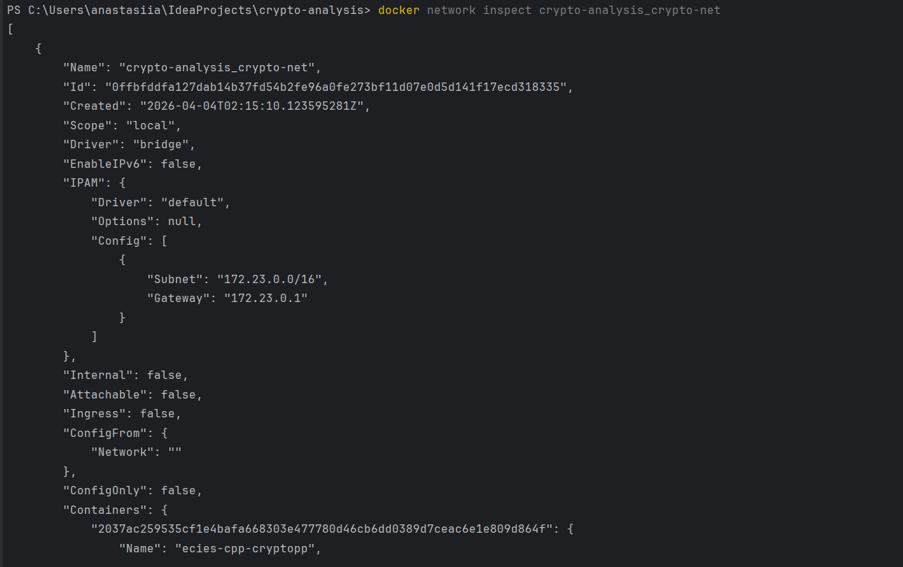
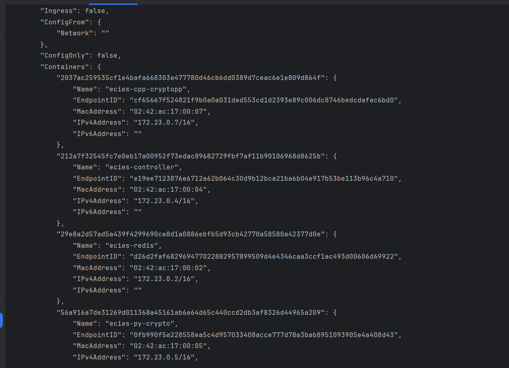
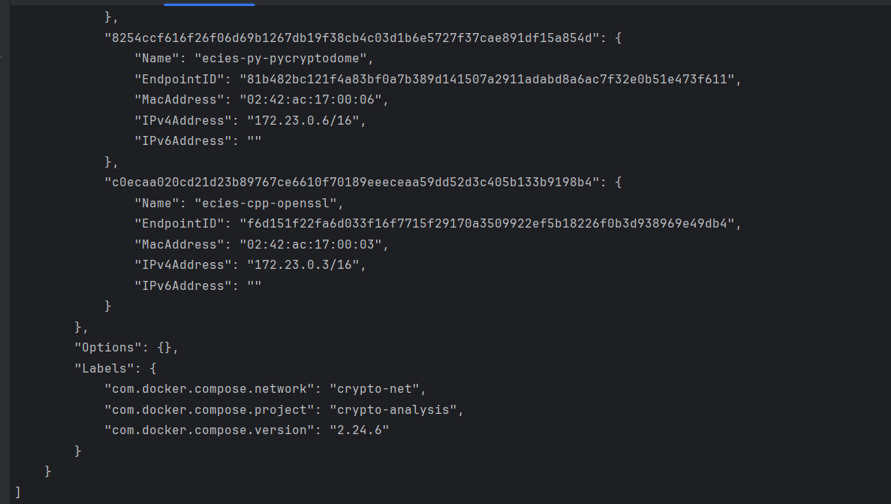

---
### 5. Test Health Check - Benchmark Controller

```powershell
curl http://localhost:8000/health
```

**Wynik:**
```json
{"status": "healthy", "service": "ECIES Benchmark Controller"}
```
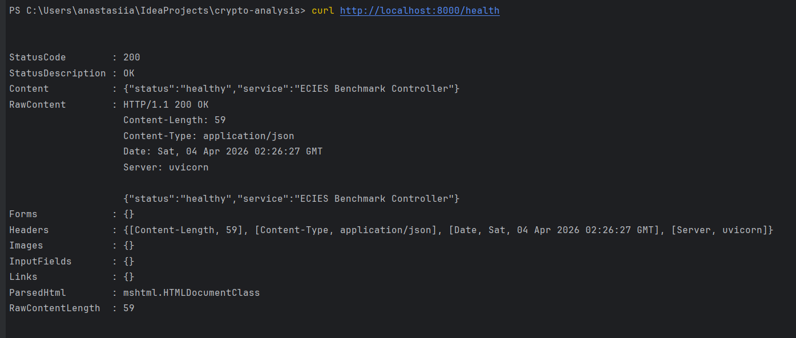

---
### 6. Test Health Check - Root Endpoint

```powershell
curl http://localhost:8000/
```
**Wynik: JSON z dostępnymi endpointami**

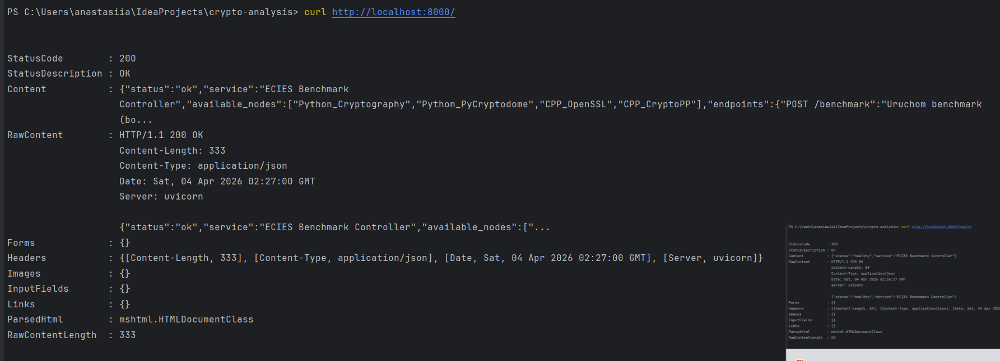

---

### 7. Sprawdzenie Redis

```powershell
docker exec ecies-redis redis-cli ping
```

**Wynik: `PONG`**

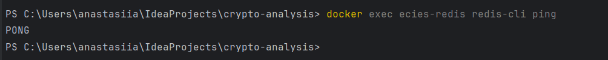

---

### 8. Sprawdzenie logów - Controller

```powershell
docker-compose logs benchmark-controller | Select-Object -Last 10
```


**Wynik: serwis działa prawidłowo**

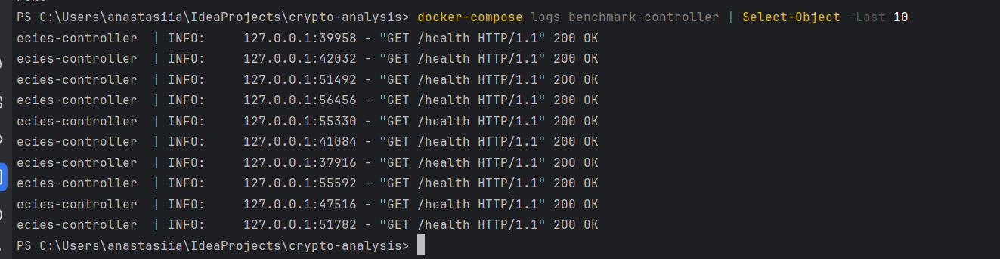

---

### 9. Sprawdzenie logów - Python Crypto Node

```powershell
docker-compose logs node-py-crypto | Select-Object -Last 5
```

**Oczekiwany wynik:** Potwierdzenie rejestracji w Redis

**Wynik: węzeł szyfrowania działa prawidłowo**

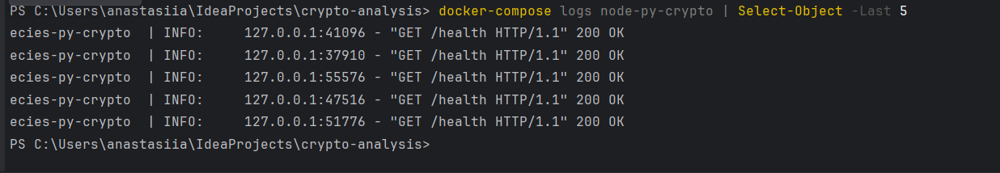


---

### 10. Logi z terminala

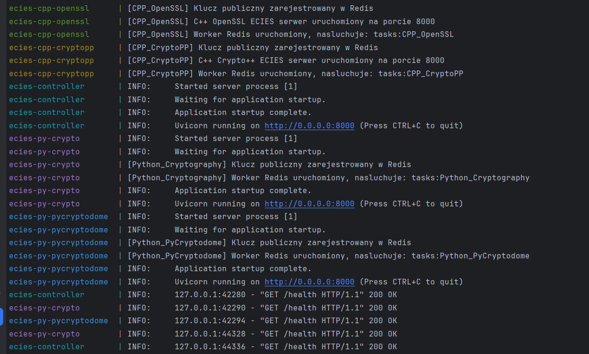

---


### 11. Build bez błędów

```powershell
docker-compose up --build
```

**Wynik: wszystkie kontenery zbudowały się i uruchomiły bez błędów** 

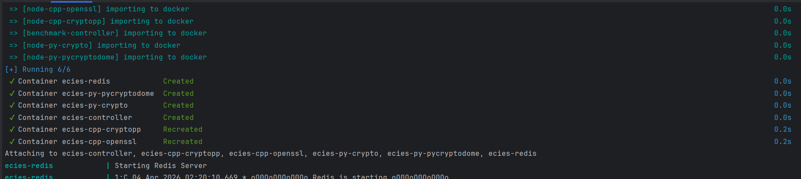

---

### 12. Komunikacja serwisów

```powershell
# Test Redis
docker exec ecies-redis redis-cli SET test:demo "works"
docker exec ecies-redis redis-cli GET test:demo
```

**Wynik: Serwisy mogą się komunikować prawidłowo** 

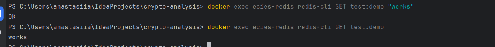


**Wyjaśnienie:**

- **OK** - polecenie SET zadziałało, wartość została zapisana w Redis
- **works** - polecenie GET zwróciło dokładnie to co zostało zapisane

**Znaczenie:**
1. Redis jest dostępny z hosta
2. Dane mogą być zapisywane i odczytywane
3. Komunikacja między serwisami działa
4. Sieć Docker prawidłowo łączy kontenery

---

## Podsumowanie

### Co zostało osiągnięte:

1.  **Plik docker-compose.yml** z 6 serwisami - prawidłowo skonfigurowany
2.  **Sieć bridge** (crypto-analysis_crypto-net) - wszyscy serwisy połączeni
3.  **Zarządzanie portami** - controller na 8000, Redis na 6379, wnętrze na 8000
4.  **Health checks** - 5 serwisów healthy, Redis Up (Redis nie wymaga konfiguracji health check, gdyż jego dostępność i stabilność zostały potwierdzone pozytywnym testem PING.)
5.  **Zmienne środowiskowe** - prawidłowo ustawione dla komunikacji
6.  **Dependency management** - wszystkie serwisy zależą od message-brokera
7.  **Build bez błędów** - wszystkie 6 kontenerów zbudowało się
8.  **Komunikacja serwisów** - Redis SET/GET działa
9.  **Logowanie** - prawidłowe logi z health checks
10.  **Storage** - volumes dostępne dla trwałości danych


### Jak uruchomić system:

```powershell
# W głównym katalogu projektu
docker-compose up --build

# Lub aby zatrzymać
docker-compose down
```

---
