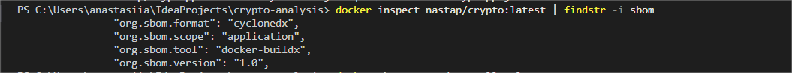
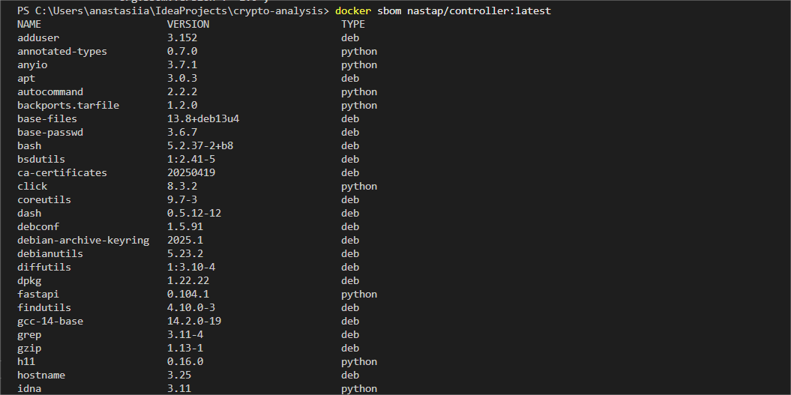
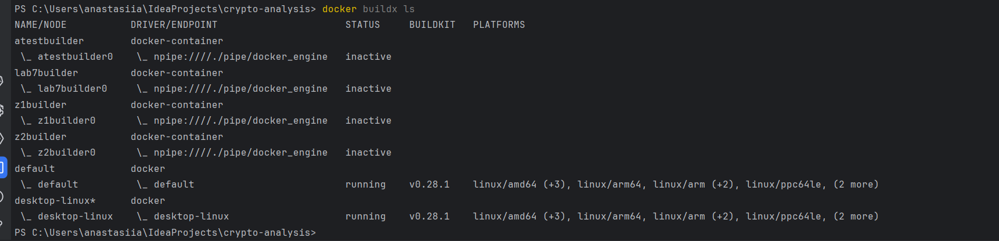
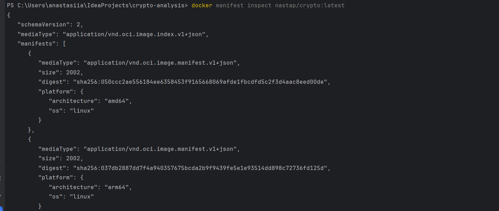
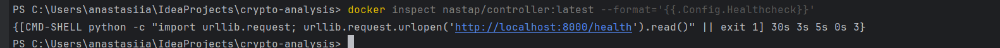

# WARUNEK 3: Budowa i push obrazów Docker na DockerHub

---
## Polecenie uruchamiające

### **Build i Push obrazów (wszystkie serwisy)**

```bash
python build_push_docker.py --push --no-cache
```

**Opcje:**
- `--push` — Push obrazów na DockerHub po zbudowaniu
- `--no-cache` — Zbuduj bez cache (gwarantuje świeże warstwy)
- bez opcji — Samo build, bez push

---

## Podsumowanie

Zostały zbudowane i przesłane na DockerHub **5 obrazów mikroserwisów** w formacie wieloarchitekturowym:


| Serwis | Repozytorium | Architekury |
|--------|-------------|------------|
| Benchmark Controller | `nastap/controller:latest` | arm64, amd64 | 
| Python Cryptography | `nastap/crypto:latest` | arm64, amd64 | 
| Python PyCryptodome | `nastap/pycryptodome:latest` | arm64, amd64 | 
| C++ OpenSSL | `nastap/openssl:latest` | arm64, amd64 | 
| C++ Crypto++ | `nastap/cryptopp:latest` | arm64, amd64 | 

---


### Generowanie pełnego SBOM 

```bash
trivy image --format cyclonedx --output sbom.json nastap/controller:latest

```

**Wynik: sbom.json (pełny raport w CycloneDX)**

---

### SBOM Files Lokalne

Wszystkie manifesty zależności zapisane w workspace:

```
sbom-controller.txt      
sbom-crypto.txt          
sbom-cryptopp.txt        
sbom-openssl.txt        
sbom-pycryptodome.txt    
```
---

### DockerHub Repositories
Otwórz w przeglądarce:
- https://hub.docker.com/r/nastap/controller
- https://hub.docker.com/r/nastap/crypto
- https://hub.docker.com/r/nastap/pycryptodome
- https://hub.docker.com/r/nastap/openssl
- https://hub.docker.com/r/nastap/cryptopp

---

## Weryfikacji

### **1. Sprawdzenie SBOM Labels w dowolnym obrazie**

```bash
docker inspect nastap/crypto:latest | findstr "org.sbom"
```
**Wynik:**




---

### **2. Wyświetlanie SBOM na przykładzie `nastap/controller:latest`**

```bash
docker sbom nastap/controller:latest
```

**Wynik** - lista 115+ pakietów z wersjami:




---

### **3. Sprawdzenie Multi-Architecture Support**

```bash
docker buildx ls
```

**Wynik:**



---

### **4. Inspekcja Manifest (Proof Multi-Arch)**

```bash
docker manifest inspect nastap/crypto:latest
```

**Wynik** - manifest dla obu architektur:



---


### **5. Weryfikacja Health Check**

```bash
docker inspect nastap/controller:latest --format='{{.Config.Healthcheck}}'
```
**Wynik:**




---


