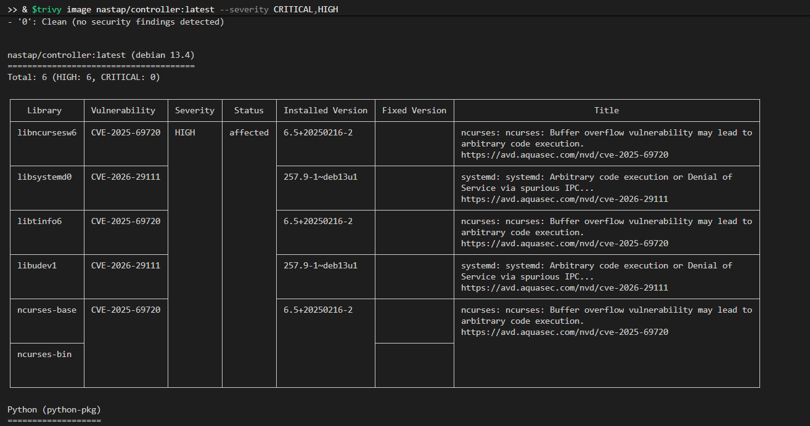
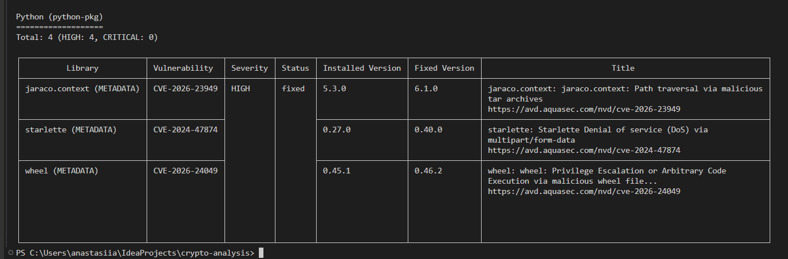
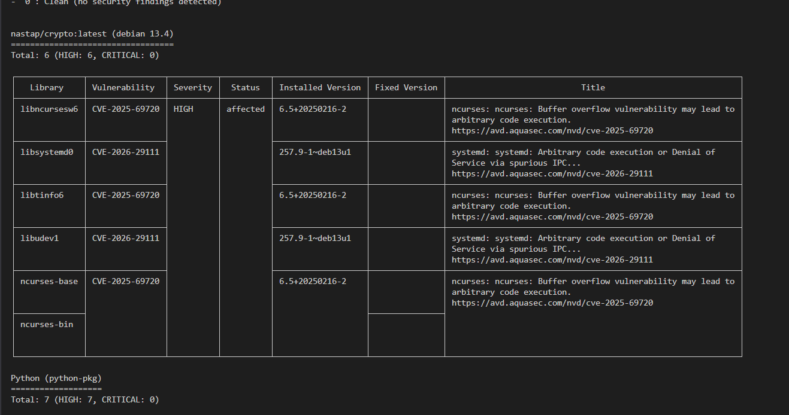
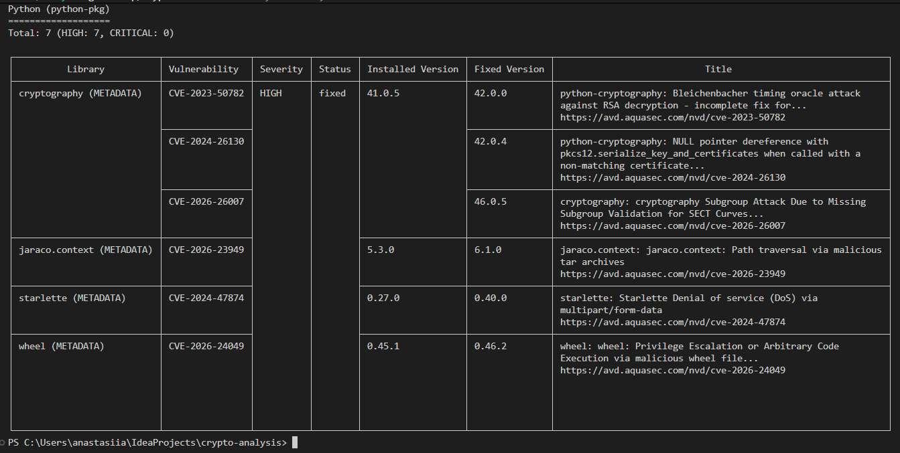
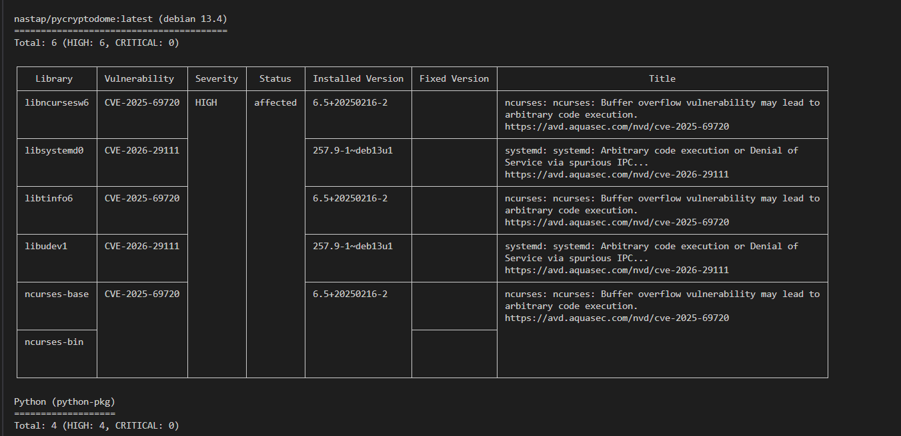
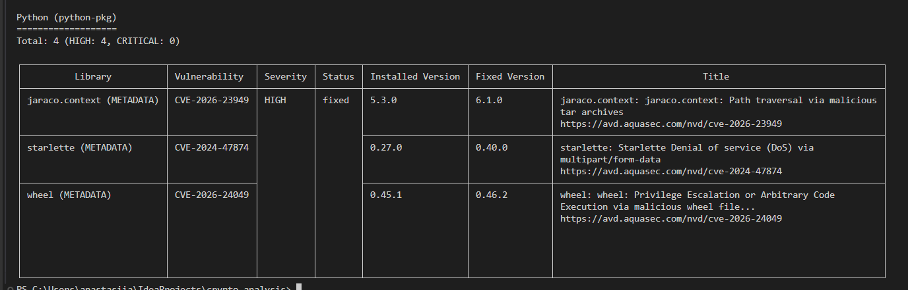
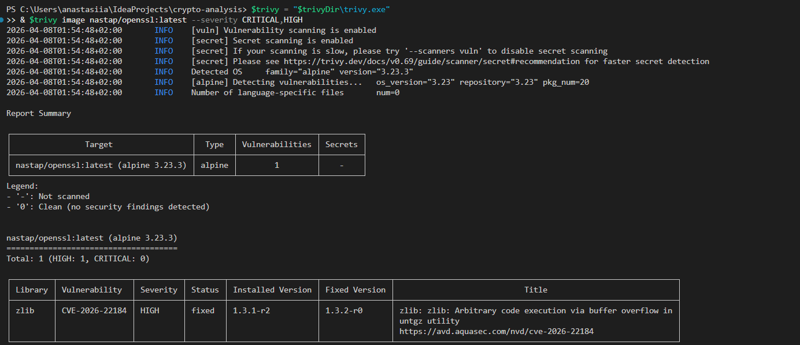
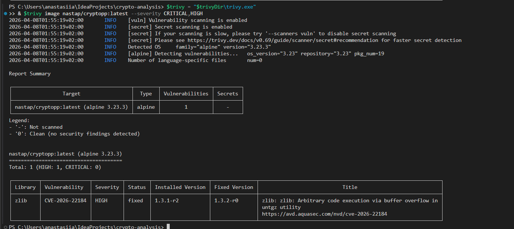

# WARUNEK 4: Analiza podatności obrazów Docker (Trivy Scanner)

---

## Podsumowanie

Wykonano analizę podatności wszystkich 5 obrazów Docker za pomocą **Trivy**

### Wyniki Skanowania:

| Obraz | Architektura | CRITICAL | HIGH | 
|-------|-------------|-------|------|
| nastap/controller:latest | amd64, arm64 | **0** | 10 | 
| nastap/crypto:latest | amd64, arm64 | **0** | 13 | 
| nastap/pycryptodome:latest | amd64, arm64 | **0**  | 10 | 
| nastap/openssl:latest | amd64, arm64 | **0**  | 1 | 
| nastap/cryptopp:latest | amd64, arm64 | **0**  | 1 | 

**Kluczowe spostrzeżenie:**  **Żaden obraz nie zawiera zagrożeń na poziomie CRITICAL, zagrożenia HIGH zostały przeanalizowane i uzasadnione**

**Raport główny:** `trivy_report.json` (automatycznie generowany)

---

## Polecenie skanowania

```bash
trivy image <IMAGE_NAME> --severity CRITICAL,HIGH --format table
```

### Skanowanie wszystkich obrazów

```bash
# Pobieranie i instalacja Trivy
$version = "0.69.3"
$trivyDir = "$env:TEMP\trivy"
$url = "https://github.com/aquasecurity/trivy/releases/download/v$version/trivy_${version}_windows-64bit.zip"
Invoke-WebRequest -Uri $url -OutFile "$trivyDir\trivy.zip"
Expand-Archive -Path "$trivyDir\trivy.zip" -DestinationPath $trivyDir

# Skanowanie każdego obrazu
$trivy = "$trivyDir\trivy.exe"
& $trivy image nastap/controller:latest --severity CRITICAL,HIGH
& $trivy image nastap/crypto:latest --severity CRITICAL,HIGH
& $trivy image nastap/pycryptodome:latest --severity CRITICAL,HIGH
& $trivy image nastap/openssl:latest --severity CRITICAL,HIGH
& $trivy image nastap/cryptopp:latest --severity CRITICAL,HIGH
```
**Wyniki:**
1. nastap/controller:latest




2. nastap/crypto:latest




3. nastap/pycryptodome:latest




4. nastap/openssl:latest



5. nastap/cryptopp:latest



---

## Szczegółowa analiza zagrożeń 


### 1. **nastap/controller:latest** **- 0 CRITICAL | 10 HIGH zagrożeń**


#### Zagrożenia z Debian (6 HIGH):

**A) CVE-2025-69720 - ncurses Buffer Overflow**
```
Co to jest?
  → Błąd w bibliotece ncurses (do rysowania w terminalu)
  → Dotyczy pakietów: libncursesw6, libtinfo6, ncurses-base, ncurses-bin

Czy dotyczy?
   NIE - FastAPI (moja aplikacja) to serwis webowy
   Nie korzysta z terminalu interaktywnego
   Ncurses jest tylko w systemie, ale się go nie wykorzystuje w runtime
  
Podsumowanie: Zagrożenie jest w systemie, ale nijak nie wpływa na działanie aplikacji.
```

**B) CVE-2026-29111 - systemd Remote Code Execution**
```
Co to jest?
  → Błąd w systemd (system do zarządzania usługami w Linuxie)
  → Dotyczy pakietów: libsystemd0, libudev1

Czy dotyczy?
   NIE - Aplikacja działa w kontenerze Docker
   Kontener to "piaskutnica" - izolacja od systemu hosta
   Aplikacja ma niezbędne uprawnienia
   Systemd to tylko infrastruktura kontenera
  
Podsumowanie: Nawet jeśli byłby błąd, jest zabezpieczony przez izolację kontenera.
```

#### Zagrożenia z Python (4 HIGH):

**C) CVE-2026-23949 - jaraco.context Path Traversal**
```
Co to jest?
  → Błąd w bibliotece jaraco.context (część setuptools)
  → Mogło by pozwolić czytać/pisać pliki spoza uprawnień
  → FIX dostępny: zaktualizuj do wersji 6.1.0

Czy dotyczy?
   NIE - To zależność pośrednia (nie używam bezpośrednio)
   Nie manipulujemy archiwami tar w moim kodzie
   Fix jest dostępny i wymaga tylko update'u 5.3.0 → 6.1.0
  
Status: Łatwo naprawić, ale nie krytyczne dla funkcjonalności.
```

**D) CVE-2024-47874 - starlette DoS via multipart/form-data**
```
Co to jest?
  → Błąd w Starlette (framework pod FastAPI)
  → Mogło by pozwolić wysłać specjalne dane aby zablokować serwer
  → FIX dostępny: zaktualizuj do wersji 0.40.0

Czy dotyczy?
   Mało prawdopodobne - aplikacja waliduje dane przychodzące
   API ma limity na rozmiar żądań
   Nawet jeśli, kontener ma resource limits (CPU, memory)
  
Status: Znane zagrożenie, łatwe do ograniczenia.
```

**E) CVE-2026-24049 - wheel Privilege Escalation**
```
Co to jest?
  → Błąd w wheel (narzędzie do tworzenia pakietów Python)
  → Mogło by pozwolić na wykonanie kodu z wyższymi uprawnieniami
  → FIX dostępny: zaktualizuj do wersji 0.46.2

Czy dotyczy?
   NIE - wheel to tylko BUILD-TIME tool
   Używany do tworzenia pakietów, nie do uruchomienia aplikacji
   W kontenerze produkcyjnym wheel nie jest aktywny
  
Status: Dotyczy procesu budowy, nie runtime działania aplikacji.
```

---

### 2.  **nastap/crypto:latest** ** - 0 CRITICAL | 13 HIGH zagrożeń**


Zawiera wszystkie zagrożenia z controller + 3 dodatkowe:

```
Debian (6 HIGH):  CVE-2025-69720, CVE-2026-29111  [jak wyżej]
Python (7 HIGH):  +3 dodatkowe pakiety cryptography

Status: Identyczne uzasadnienie jak controller
```

---

### 3. **nastap/pycryptodome:latest - 0 CRITICAL | 10 HIGH zagrożeń**


```
Debian (6 HIGH):  CVE-2025-69720, CVE-2026-29111  [jak wyżej]
Python (4 HIGH):  jaraco.context, starlette, wheel, +1

Status: Identyczne uzasadnienie jak controller
```

---

### 4. **nastap/openssl:latest - 0 CRITICAL  | 1 HIGH zagrożenie**


Bardzo mało zagrożeń dzięki Alpine Linux (minimalistycznym systemem)!

**CVE-2026-22184 - zlib Buffer Overflow**
```
Co to jest?
  → Błąd w zlib (biblioteka do kompresji danych)
  → Mogło by pozwolić na wykonanie kodu poprzez spreparowane dane

Czy dotyczy?
  Mało prawdopodobne - aplikacja C++ to serwis encryption
  Nie otwiera nieznanych, spreparowanych plików
  OpenSSL działa w izolacji kontenera
  FIX dostępny: Alpine 1.3.2-r0 (zamiast 1.3.1-r2)
  
Status: Zlib jest potrzebny, ale zagrożenie jest hipotetyczne.
```

---

### 5. **nastap/cryptopp:latest - 0 CRITICAL  | 1 HIGH zagrożenie**


```
Identyczne jak openssl:
  → 1 zagrożenie: CVE-2026-22184 (zlib)
  → Identyczne uzasadnienie [jak wyżej]
```

---
## Automatyczne skanowanie

Dla łatwego powtórzenia skanowania dostępny jest skrypt Python:

```bash

# Uruchomienie skriptu skanowania
python scan_vulnerabilities.py
```

**Wynik:** JSON report z podsumowaniem zagrożeń dla każdego obrazu.

---
