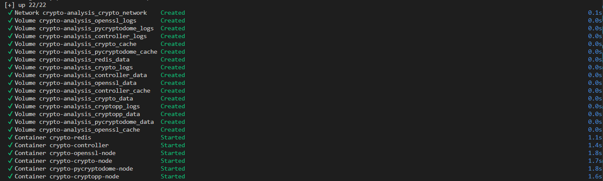
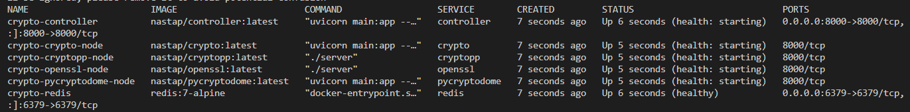
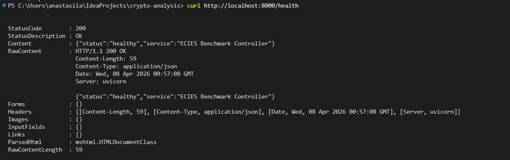
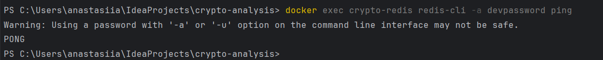

# WARUNEK 5: Testowa (deweloperska) wersja pliku docker-compose.yaml


## **Weryfikacja**

1. **Uruchomienie systemu:**
```bash
docker-compose -f docker-compose.dev.yml --env-file .env.dev up -d
```



2. **Sprawdzenie statusu:**
```bash
docker-compose -f docker-compose.dev.yml ps
```
**Wynik**: wszystkie 6 kontenerów **Up** i biegną



3. **Test API Controller:**
```bash
curl http://localhost:8000/health
```
**Wynik**: HTTP 200 OK
```json
{"status":"healthy","service":"ECIES Benchmark Controller"}
```



3. **Test Redis Connectivity**
```bash
docker exec crypto-redis redis-cli -a devpassword ping
```

**Wynik: PONG**


---

