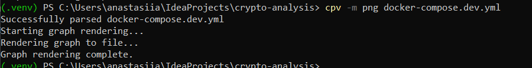
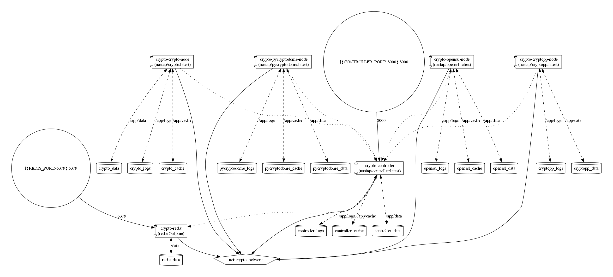

# WARUNEK 6: Graficzna reprezentacja docker-compose.dev.yml za pomocą compose-viz

## Generowanie diagramu
```bash
cpv -m png docker-compose.dev.yml
```


## Wygenerowany diagram architektury `compose-viz.png`


